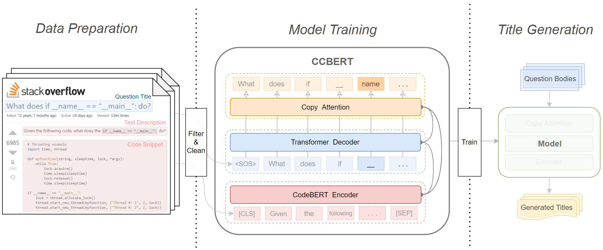

# CCBERT

Code for paper(under review) "**[Improving Stack Overflow question title generation with copying enhanced CodeBERT model and bi-modal information](https://arxiv.org/abs/2109.13073)**"

CCBERT is a Copying enhanced CodeBERT model for Stack Overflow title generation.



### Package Requirement

To run this code, some packages are needed as follows:
Python version 3.7
```
OpenNMT-py == 2.0.1
pytorch == 1.6.0
rouge == 1.0.0
nltk == 3.6.2
transformers == 4.6.1
```

### Dataset and Models

Here is the directory structure of our repository:

```
├─data_prepare
└─models
    ├─ccbert
    ├─elastic
    ├─onmt_lstm
    └─oracle
```
#### data_prepare

Files in this directory are the scripts for data pre- and post-processing, including all the python code for filtering, cleaning, partitioning, counting and figure drawing.

Our dataset are composed of two parts: the Python subset and the Java subset. We upload those processed data to kaggle.com for intuitive interaction. [Stack Overflow Title Generation (py&java filtered) | Kaggle](https://www.kaggle.com/qwzfj999/stack-overflow-title-generation-pyjava-filtered)

#### models

We put the code for CCBERT  and all baseline models in this directory except BART, for which we use [fairseq's](https://github.com/pytorch/fairseq/tree/master/examples/bart) implementation.

Specifically, to run CCBERT, one should first view and change the basic configures like file_path, version_id in the config.py. Then run the main.py for training and evaluation.

#### Citation
If you find this work inspiring for your research, please cite our paper:
```
@misc{zhang2021improving,
      title={Improving Stack Overflow question title generation with copying enhanced CodeBERT model and bi-modal information}, 
      author={Fengji Zhang and Jacky Keung and Xiao Yu and Zhiwen Xie and Zhen Yang and Caoyuan Ma and Zhimin Zhang},
      year={2021},
      eprint={2109.13073},
      archivePrefix={arXiv},
      primaryClass={cs.CL}
}
```
